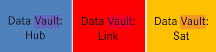
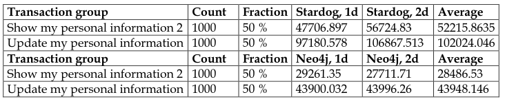

# What advantages does a graph database like Neo4j have for Data Warehouses?

Now that we used Neo4j for a simple example I want to shortly address how it can be useful in an environment with huge amounts of data like a data warehouse. This is neither a complete list of usecases nor a detailed explanation but only intended to give a short overview.

In large data warehouses thousands of data flows will depend on each other. This dependency chain can be modeled as a directed graph. By using various graph algorithm one can identify critical nodes with many edges (hubs) and accordingly tune the execution time. [4]

Another usecase for graph databases is the Data Vault Model. As depicted in the image below the data vault architecture uses hubs, links and sats.

Andreas Buckenhofer. Lecture @DHBW: Data Warehouse. Lecture slides. 04 Modeling. DHBW Stuttgart, delivered November 2021.

All the relationships are modeled as many to many relationships. The data vault architecture is inspired by graph theory. Depending on the exact usecase using a graph database can address shortcomings of relational databases for data warehousing. [4] 

So depending on the model you want to implement a relational or a graph database may fit your usecase better. Learning about both types is substantial to decide which one to use for the best outcome.

Lastly I want to reference a benchmark comparing Neo4j with Stardog (another graph database). The benchmark resulted in Neo4j performing better than Stardog for write operations by a signle user aswell as hundreds of parallel users. Query operations by hundreds of parallel users on the other hand performed roughly equal.
Below table shows transaction times while inserting and querying data parallel. Here Neo4j performed roughly twice as good. [4]

 [3]
For more information about the benchmark please check the literature.

### Literature

Neo4j. Inc. The Neo4j Graph Data Platform. [https://neo4j.com/product/](https://neo4j.com/product/) (besucht am 21.11.2021). [1]

Neo4j. Inc. Scalar functions. [https://neo4j.com/docs/cypher-manual/current/functions/scalar/#functions-coalesce](https://neo4j.com/docs/cypher-manual/current/functions/scalar/#functions-coalesce) (besucht am 22.11.2021) [2]

Oula Paltto. INTEGRATING A SMART CITY DATA WAREHOUSE EFFICIENTLY WITH A CLOUD INFRASTRUCTURE. URL: [https://jyx.jyu.fi/bitstream/handle/123456789/45664/URN%3aNBN%3afi%3ajyu-201504181620.pdf?sequence=1&isAllowed=y](https://jyx.jyu.fi/bitstream/handle/123456789/45664/URN%3aNBN%3afi%3ajyu-201504181620.pdf?sequence=1&isAllowed=y) (besucht am 21.11.2021). [3]

Kevin Tardivel (12.06.2017). What are the Benefits of Graph Databases in Data Warehousing?. [https://sonra.io/data-warehouse/benefits-graph-databases-data-warehousing/](https://sonra.io/data-warehouse/benefits-graph-databases-data-warehousing/) [4]
