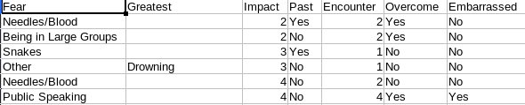

We study we use for this example was originally used to find out if the participants are satisfied with the survey design. The data was chosen because the data structure is quiet simple and the survey only involved 80 people so the data amount is kept small aswell.

We data gathered:
- Type of the fear as String
- Impact of the fear as Integer
- If the fear is based on past experiences as Boolean
- The frequency of encounters as Integer
- If the participant thinks the fear can be overcome as Boolean
- If the person is embarassed as Boolean

The additional column Greatest that represents fears that are not listed as fear will not be used for this example to keep everything simple.

A screenshot of the data visualized as table can be seen below.

